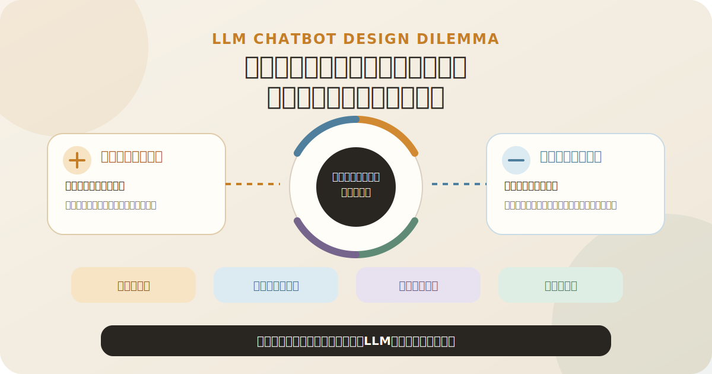

# 「そんなことは言っていない」と「つまらない回答」の間で

## 独自理論を理解し、解説するLLMチャットボット設計のジレンマ

<p align="center">
  
</p>

> **言っていないことは言わせない。**  
> **分からないことを、分かったふりで埋めさせない。**  
> **それでも、考えることまではやめさせない。**

独自理論をLLMに解説させると、三つの不満が出てきます。

| 不満 | 起きていること |
|---|---|
| 🗯️ **「私はそんなことを言わない。そもそも言っていない」** | 独自理論を勝手に拡大解釈している |
| 🎭 **「適当なことを、正しそうに言うな」** | 未定義部分を、もっともらしく補完している |
| 💤 **「失敗を恐れて、つまらない回答になるな」** | 制約を恐れ、一般論・注意喚起・無回答へ逃げている |

---

## 中心にあるジレンマ

| 設計 | 起こりやすい失敗 |
|---|---|
| 🔥 **LLMを自由にする** | 拡大解釈・捏造・越権・万能理論化 |
| 🧊 **LLMを厳しく縛る** | 平凡・萎縮・一般論・「分かりません」で停止 |

設計上の問いは、単に「自由か、制約か」ではありません。

**独自理論の意味を壊さず、それでも未知の質問に対して有益に考えさせるには、何を固定し、何を自由にするべきか。**

Bodywork工学チャットボットでは、この問題に対して四つの対策を組み合わせています。

| 対策 | 役割 |
|---|---|
| 🟠 **定義化と階層化** | 理論の中心と、知識の上下関係を固定する |
| 🔵 **役割分担・問いの分解・アイデア指向** | 一つの理論による万能化を防ぐ |
| 🟣 **失敗からの思考採掘** | 「なんか違う」を判断原理へ変える |
| 🟢 **文脈資産化** | 良い回答を生んだ世界の見方を保存する |

---

<details open>
<summary><strong>🟠 1．定義化と階層化</strong><br><sub>「なんとなく分かっている」を、LLMが運用できる構造へ変える</sub></summary>

### 定義化――概念の輪郭を作る

人間は、厳密に言葉へしていない概念でも、経験・身体感覚・前後の文脈を使って運用できます。

LLMには、その暗黙の背景がありません。

そのため独自概念について、少なくとも次を言語化する必要があります。

- 何を指すのか
- 何と似ているのか
- 何とは違うのか
- どこで使い、どこでは使わないのか
- どの因果関係の中にあるのか
- どんな言い換えや拡大解釈を禁止するのか

これは単なる用語集作りではありません。

**本人の中で感覚的に使えていた区別を、他者やLLMでも再現できる粒度まで外部化する作業**です。

### 階層化――理論内の正しい位置へ置く

階層化は、情報を種類別に分類することだけではありません。

独自理論を構成する知識に、**抽象度・依存関係・優先順位**を与えます。

```text
根幹思想
  ↓
世界モデル
  ↓
概念と因果関係
  ↓
判断原則
  ↓
具体的な手段・体操
  ↓
応答案・個別事例
```

上位層は下位層の意味を拘束します。

- 一つの体操手順から、理論全体の思想を逆算しない
- 一つの応答例で、概念の定義を書き換えない
- AIの仮説を、本人が確定した根幹思想へ昇格させない
- 検索で見つけた断片を、理論全体の代表として扱わない

また、**出所と確度**も別軸で残します。

- 本人確認済みの内容
- AIが正本から整理した内容
- AIが新しく提案した未裁定仮説

定義化が「一つ一つの概念の輪郭を作る作業」なら、階層化は「その概念や手段を、理論全体のどこへ置き、何に従わせるかを決める作業」です。

> **エッセンス**  
> LLMに理論を理解させる前に、自分の理論が何でできていて、何が何を拘束するのかを、自分自身が説明できる形にする。

</details>

---

<details>
<summary><strong>🔵 2．役割分担・問いの分解・アイデア指向</strong><br><sub>独自理論だけで、世界のすべてを説明させない</sub></summary>

独自理論の資料だけを与えると、LLMは本来その理論の管轄ではない問いまで、独自用語で説明しようとします。

その結果、独自理論が万能理論化し、診断・科学的断定・生活助言まで始めます。

### 知識領域ごとに判定権を分ける

| 領域 | 主に判定できること |
|---|---|
| 🏥 **医療** | 診断、安全、受診判断 |
| 🧪 **運動・スポーツ科学** | 集団的効果、運動負荷、一般的機序 |
| 🪑 **人間工学** | 道具、環境、作業条件 |
| 🧭 **独自理論** | 独自概念、身体の見方、観察方法 |
| 🥋 **既存Bodywork・武道** | 比較材料、別の説明候補 |
| 🤖 **AI** | 新しい仮説、説明候補、問いの再構成 |
| 👤 **本人の身体** | 今日その人に合ったか、前後で何が変わったか |

重要なのは、どの知識が一番偉いかを決めることではありません。

**今の問いの、どの部分を誰が判定できるのかを決めること**です。

### 質問を一つの塊として扱わない

たとえば、

> 「この体操は腰痛に効きますか？」

という問いには、複数の問いが混ざっています。

| 分解された問い | 主な担当 |
|---|---|
| 安全に行えるか | 医療・安全 |
| 集団的な効果が確認されているか | 科学 |
| Bodywork工学ではどう位置づけるか | 独自理論 |
| 今日の本人に合っていたか | 本人の前後差 |

問いを分解すれば、一つの理論だけで全部を説明する必要がなくなります。

### 最終出力を「正解」ではなく「アイデア」として扱う

```text
複数の見方を出す
  ↓
違いを保ったまま並べる
  ↓
必要なら小さく試す
  ↓
何を採用するかはユーザーが決める
```

「統合しない」とは、説明をバラバラに投げることではありません。

それぞれについて、

- 何を説明しているのか
- 何は説明できないのか
- どこまで確かなのか

を示したうえで、無理に一つの真実へ潰さないということです。

> **エッセンス**  
> すべてを独自理論で説明しない。問いを分解し、適切な知識へ担当させ、最後の選択権をユーザーへ戻す。

</details>

---

<details>
<summary><strong>🟣 3．LLMの失敗から、自分の思考を採掘する</strong><br><sub>「なんか違う」を、設計資産へ変える</sub></summary>

LLMの回答を読んだとき、作り手は次のような違和感を持つことがあります。

- 理屈は通っているが、私はこうは言わない
- 間違いとは言い切れないが、何かがズレている
- 安全ではあるが、つまらない
- 事実としては近いが、概念として違う

この違和感は、単なる不満ではありません。

**本人の中では運用されているが、まだ言葉になっていない判断基準**が隠れています。

### 齟齬を較正資産へ変える流れ

```text
LLMの失敗出力
  ↓
本人の違和感
  ↓
何が違うかを言語化
  ↓
判断原則・禁止推論・判例へ変換
  ↓
プロンプトやKnowledgeへ反映
```

### 具体例

**悪い回答**

> 姿勢を改善するために、この体操を続けましょう。

**望ましい回答**

> この動きの前後で、立ったときの重さの落ち方が変わるかを見る方法があります。

**差分**

- AIが「姿勢改善」を本人の目的として勝手に決めている
- 効果があると断定し、継続まで命令している
- Bodywork工学では、観察方法を渡し、採否を本人へ残す

これは回答例を増やしているだけではありません。

**失敗した出力を、本人の暗黙の判断原理を掘り出すための採掘装置として使っている**のです。

> **エッセンス**  
> 誤答を直すだけで終わらせない。その誤答に感じた違和感から、自分でも言葉にしていなかった判断原理を発見する。

</details>

---

<details>
<summary><strong>🟢 4．文脈資産化</strong><br><sub>理想的な回答ではなく、その回答を生んだ「見え方」を保存する</sub></summary>

長い対話の中で、突然、非常に良い回答が出ることがあります。

しかし、その回答文だけを保存しても、別の質問や別のモデルでは再現できません。

本当に保存すべきなのは、

**その回答を生成したとき、LLMがどのような世界の切り方を共有していたのか**

です。

### 一つの自己説明へ頼らない

良い回答をしたLLMへ、

> 「あなたは何を理解していたから、その回答ができたのか」

と聞いても、正確な内部状態が出てくるとは限りません。

そこで、次の材料を横断的に解析します。

- 多数の質問と回答
- 良かった回答とズレた回答
- 本人による修正
- 採用・却下の裁定
- 繰り返し現れた判断パターン

そこから、

- どんな概念境界を守っていたか
- どの問いで、どの知識を選んだか
- どんな推論を避けたか
- 何をユーザーへ返していたか
- どんなときに新しい見方が生まれたか

を抽象化します。

### 抽象と具体を分けて保存する

| 資産 | 役割 |
|---|---|
| **F0** | 世界モデルと全体座標 |
| **F9** | 知識領域の選び方と禁止推論 |
| **判例** | 判断の境界と失敗パターン |
| **質問回答集** | 具体的な地形と応答の幅 |
| **正本** | 本人確認済みの定義と内容 |
| **未裁定資料** | AIが提案した仮説 |

質問回答集は具体的な地形です。

F0やF9は、その地形を読むための地図です。

両方を組み合わせることで、特定の回答文を物真似するのではなく、未知の質問にも同じ座標系から考えられるようになります。

### 出所を混ぜない

```text
本人が確認した内容
≠ AIが正本から整理した内容
≠ AIが新しく推論した内容
```

この違いを残したまま保存することで、新しいモデルは過去ログをゼロから再解釈するのではなく、

**共同探索で採掘された世界モデル・概念境界・判断パターン・失敗例を持った地点**

から開始できます。

> **エッセンス**  
> 何を言ったかではなく、その発言を可能にした世界の見方を、出所と確度を保ったまま保存する。

</details>

---

## 全体の循環

```text
曖昧な独自概念を定義する
  ↓
知識に上下関係を与える
  ↓
問いを分解し、判定権を分担する
  ↓
回答を正解ではなくアイデアとして渡す
  ↓
LLMの失敗から暗黙の判断原理を採掘する
  ↓
採掘した原理を蓄積し、出力を較正する
  ↓
良い出力を生んだ文脈を、抽象と具体の両方で保存する
  ↓
別モデルへ移植可能な資産にする
  ↺
```

これは、プロンプトを一度書いて完成する作業ではありません。

**人間とLLMの共同探索によって、独自理論の意味・境界・判断様式を徐々に外部化する循環**です。

---

## 固定するものと、自由にするもの

| 硬く固定する中心 | 自由に探索させる外側 |
|---|---|
| 独自概念の意味 | 問いの新しい分解 |
| 情報の出所 | 複数の知識領域の選択 |
| 知識の上下関係 | 説明の組み立て方 |
| 判定権 | 新しい仮説 |
| 推論してよい範囲 | ユーザーの見方を変える切り口 |
| 安全境界 | 未知の質問への探索 |

**壊れてはいけない中心は硬く固定し、その外側ではLLMを自由に探索させる。**

これが、

- 適当なことを言わせない
- 分からないことを勝手に埋めさせない
- それでも退屈な無回答にはしない

を同時に成立させるための設計です。

---

## 一文でまとめると

独自理論を理解・解説するチャットボットとは、理論を大量に覚えさせるものではありません。

**概念を定義し、知識を階層化し、問いと判定権を分解し、LLMの失敗から本人の暗黙の思考様式を採掘し、それを出所と確度を保った文脈資産として固定することで、自由な推論と忠実な再現を両立させる仕組み**です。

> **言っていないことは言わせない。**  
> **分からないことを、分かったふりで埋めさせない。**  
> **それでも、考えることまではやめさせない。**
