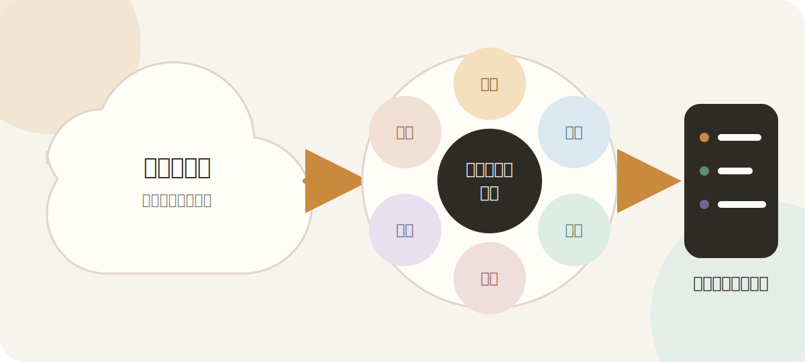

# LLMに独自理論を実装するための6本柱

<p align="center">
  
</p>

> **質問は広く受ける。**  
> **ただし、回答を作る座標と境界は固定する。**

LLMは高性能である一方、自由度が高く、独自理論を資料として渡すだけでは安定して扱えません。

| 起こりやすい崩壊 | 何が起こるか |
|---|---|
| 🔀 **意味の混同** | 独自概念を、似た一般概念へ言い換える |
| ⚖️ **越権** | 医学・科学・本人・AIの判定範囲を混ぜる |
| 🧩 **勝手な補完** | 未定義部分をもっともらしく埋める |
| 🫥 **文脈喪失** | 長期対話やモデル変更で判断基準を失う |

問題は、LLMの知識不足だけではありません。

**意味の混同・越権・補完・文脈喪失を、設計によって統治すること**が必要です。

---

## 6本柱の全体像

| 柱 | 統治する対象 | 一言でいうと |
|---|---|---|
| 🟠 **定義化** | 意味 | 似ていることと同じであることを分ける |
| 🔵 **階層化** | 知識の上下関係 | 上位層が下位層の解釈を拘束する |
| 🟢 **構造化** | 推論 | 考える順序を固定する |
| 🔴 **役割分担** | 権限 | 誰が何を判定できるかを分ける |
| 🟣 **文脈資産化** | 継承 | 発見された世界の見方を外部へ残す |
| 🟤 **評価・較正** | 改善 | 崩れ方を次の設計資産へ変える |

---

<details open>
<summary><strong>🟠 1. 定義化――意味を守る</strong><br><sub>似ていることと、同じであることを分ける。</sub></summary>

### なぜ必要か

LLMは、意味が近い言葉を同じカテゴリーへまとめやすい性質があります。

たとえば独自概念の「シャーシ」を渡しても、

**シャーシ → 体幹 → コア → 一般的な体幹トレーニング**

というように、既存の一般概念へ吸収される可能性があります。

### 何を固定するか

- 概念の定義
- 使用してよい範囲
- 似ている概念との共通点
- 決定的に異なる点
- 他概念との因果関係
- 禁止される言い換え
- 使用時の文法や発火条件

> **防ぐ崩壊**  
> 独自語彙が一般用語へ置き換わり、理論全体が既存理論の説明へ戻ること。

</details>

<details open>
<summary><strong>🔵 2. 階層化――知識の上下関係を決める</strong><br><sub>上位層が下位層の解釈を拘束する。</sub></summary>

### 単なる情報分類ではない

階層化は、思想・手順・例を種類別に整理することだけではありません。

核心は、**知識に抽象度・優先順位・依存関係を与えること**です。

すべての情報を平面に並べると、次のような逆転が起きます。

- 一つの体操手順が、理論全体の身体観を上書きする
- 一つの過去回答が、すべての質問に適用される
- 検索で拾った断片が、理論全体を代表する
- 下位の具体例から、上位概念が勝手に再定義される

### 階層化で決めること

```text
憲法・禁止事項
      ↓
F0 世界モデル
      ↓
正本・判断OS・判例
      ↓
F9 外部知識レンズ
      ↓
体操カード・応答事例
      ↓
セッション状態
```

- 抽象から具体へ、どの層がどの層を解釈するか
- 衝突したときに、どの層を優先するか
- 常時参照する層と、質問時だけ検索する層
- 下位層が上位層を書き換えない規則
- 上位原則を、具体的な回答へどう降ろすか

> **核心**  
> 局所的な情報が理論全体を乗っ取らないように、知識へ「上下関係」と「拘束関係」を与える。

### 役割分担との違い

- **階層化**：知識同士の上下関係を決める
- **役割分担**：人・情報源・媒体が何を判定できるかを決める

</details>

<details>
<summary><strong>🟢 3. 構造化――考える順序を固定する</strong><br><sub>回答のうまさではなく、思考手順を設計する。</sub></summary>

### なぜ必要か

LLMへ「適切に答えてください」とだけ指示すると、判断はその場の文章生成能力に依存します。

同じ内容でも、質問の言い方や会話の流れによって結論が変わりやすくなります。

### 回答生成の基本工程

```text
問いを分解する
      ↓
安全上の管轄を確認する
      ↓
問いの種類を判定する
      ↓
必要な知識を検索する
      ↓
独自理論の座標へ配置する
      ↓
禁止推論・越権を確認する
      ↓
見方・観察・実験として提示する
      ↓
最終判断を本人へ返す
```

> **防ぐ崩壊**  
> 質問の言い回しや会話の勢いだけで、判断基準が変化すること。

</details>

<details>
<summary><strong>🔴 4. 役割分担――判定権を分ける</strong><br><sub>誰が一番正しいかではなく、誰がその問いを判定できるか。</sub></summary>

### なぜ必要か

LLMは、異なる情報源を自然な一つの説明へ統合します。

しかし、医学、科学、独自理論、本人の身体、AIでは、それぞれ判定できる対象が異なります。

| 判定主体 | 主に判定できること |
|---|---|
| **医学** | 安全、診断、受診判断 |
| **科学** | 集団的効果、経験的な真偽 |
| **独自理論の正本** | 独自語彙、思想、守備範囲 |
| **本人の身体** | この人に合うか、前後差があるか |
| **AI** | 説明候補、新しい仮説、未確定案 |

媒体も分業します。

- **サイトbot**：初めての人の入口
- **深い対話用チャット**：理論探索、比較、仮説形成
- **体操ページ**：動画と正式手順
- **正本**：定義と裁定

> **防ぐ崩壊**  
> AIの推測が診断になったり、科学的平均が個人の体感を否定したりすること。

</details>

<details>
<summary><strong>🟣 5. 文脈資産化――探索成果を外部へ残す</strong><br><sub>会話ではなく、発見された世界の見方を保存する。</sub></summary>

### なぜ必要か

長い対話では、本人も明確に言語化していなかった判断軸や概念関係が発見されます。

しかし、それを会話履歴だけに置くと、

- 会話が終わると失われる
- モデルを替えると再現できない
- 新しいモデルが最初から独自解釈する
- AIの推論と本人の確定内容が混ざる

という問題が起きます。

### 外部化するもの

- 世界モデル
- 概念間の因果関係
- 判断パターン
- 禁止推論
- 失敗例
- 応答事例
- 未確定の仮説

ただし、すべてを同じ知識として保存しません。

| 層 | 状態 |
|---|---|
| **本人確認済みの正本** | 確定内容 |
| **AIが正本から編纂した地図** | 派生・整理された座標系 |
| **本人未裁定の仮説・応答案** | 未確定案 |

> **防ぐ崩壊**  
> モデルを替えるたびに、独自理論をゼロから再解釈させること。

</details>

<details>
<summary><strong>🟤 6. 評価・較正――崩れ方を資産にする</strong><br><sub>正しく動くことを期待せず、失敗を次の設計材料へ変える。</sub></summary>

### なぜ必要か

どれだけ精密な指示を書いても、LLMは、

- 長い会話で一般論へ戻る
- 親切さから余計な助言をする
- 未定義部分を補完する
- 制約を守りながら別の形で同じ失敗をする

可能性があります。

### 失敗を判例化する

```text
悪い回答
   ↓
望ましい回答
   ↓
なぜ違うのか
```

この差分を一単位として蓄積します。

### 検証方法

- 固定質問テスト
- 長会話テスト
- 敵対的・誘導的質問テスト
- 検索断片の模倣テスト
- F0・F9を外した比較テスト
- 本人による採用・修正・却下

> **得られる資産**  
> 単なる正解集ではなく、どこで・なぜ・どのように理論が崩れるかを示す判例集。

</details>

---

## まとめ

> ### 意味・知識階層・推論・権限・文脈・改善を設計し、LLMの自由度を独自理論の文脈内に収める。

**意味を守る。**  
**知識の上下関係を決める。**  
**考える順序を固定する。**  
**越権させない。**  
**文脈を失わせない。**  
**崩れ方から学ぶ。**
